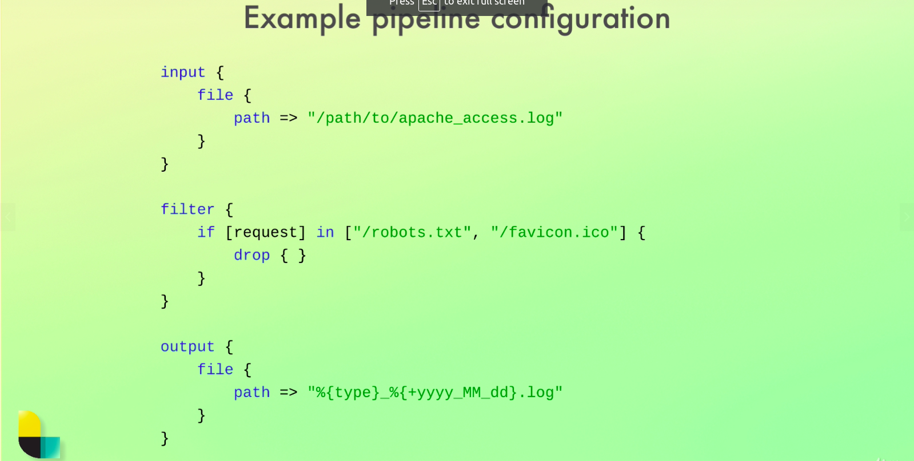

# elasticSearch-ELK-
Learn Elasticsearch from scratch and begin learning the ELK stack (Elasticsearch, Logstash &amp; Kibana) and Elastic Stack.
#ELK Setup

### Install Elastic Search

##### Download link : https://www.elastic.co/downloads/elasticsearch
##### Extract tar file -> go inside file -> start bin/elasticsearch
Elastic Search Default port is 9200

### Install KIBANA

##### Download link : https://www.elastic.co/downloads/kibana
##### Extract tar file -> go inside file -> start bin/kibana
Elastic Search Default port is 5601

## Information about stack
### ELK  Setup

### Elastic Search - Data Storing, Description, Cluster

### Logstash - Config, pipeline

### Kibana Dashboard Example

### Inspecting Cluster by using Kibana

